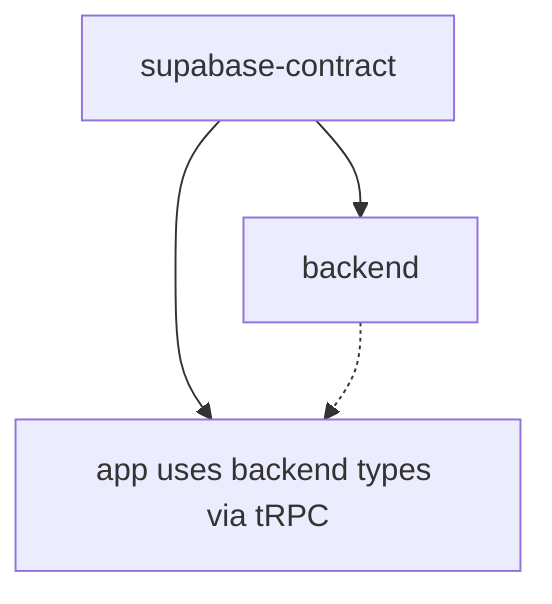

# Workspace Development Workflow

## Overview

This document provides comprehensive guidelines for developing within the IoT Gateway UI monorepo, covering pnpm workspace management, build processes, development workflows, and troubleshooting common issues.

## Table of Contents

1. [Workspace Structure and Package Management](#workspace-structure-and-package-management)
2. [pnpm Workspace Commands and Workflows](#pnpm-workspace-commands-and-workflows)
3. [Package Dependency Management](#package-dependency-management)
4. [Build Order and Coordination](#build-order-and-coordination)
5. [Development Server Setup with mprocs](#development-server-setup-with-mprocs)
6. [Code Quality Tooling Configuration](#code-quality-tooling-configuration)
7. [Troubleshooting Guide](#troubleshooting-guide)

## Workspace Structure and Package Management

### Project Structure

```
iotgw-ui/
├── package.json              # Root workspace configuration
├── pnpm-workspace.yaml       # Workspace package definitions
├── pnpm-lock.yaml           # Lock file for all dependencies
├── mprocs.yaml              # Multi-process development configuration
├── .env                      # Environment variables
├── CLAUDE.md                 # AI assistant guidelines
├── backlog/                  # Project management with Backlog.md
│   ├── tasks/               # Active tasks
│   ├── completed/           # Completed tasks
│   ├── docs/                # Project documentation
│   └── decisions/           # Architecture Decision Records (ADRs)
├── apps/
│   ├── app/                 # Frontend React application
│   │   ├── package.json     # @iotgw/app
│   │   ├── src/            # Source code
│   │   ├── public/         # Static assets
│   │   └── vite.config.ts  # Vite configuration
│   └── backend/             # Backend tRPC API server
│       ├── package.json     # @iotgw/backend
│       ├── src/            # Source code
│       └── .env            # Backend environment variables
├── packages/
│   └── supabase-contract/   # Shared database types
│       ├── package.json     # @iotgw/supabase-contract
│       ├── src/            # TypeScript type definitions
│       └── tsdown.config.ts # Build configuration
└── supabase/
    └── migrations/          # Database migrations
```

### Workspace Configuration

```yaml
# pnpm-workspace.yaml
packages:
  - apps/* # All applications
  - packages/* # All shared packages
onlyBuiltDependencies:
  - "@tailwindcss/oxide" # Tailwind CSS v4 native dependencies
  - esbuild # Build tool native dependencies
  - supabase # Supabase CLI native dependencies
```

### Package Naming Convention

- **Applications**: `@iotgw/app`, `@iotgw/backend`
- **Shared packages**: `@iotgw/supabase-contract`
- **Internal dependencies**: Use `workspace:*` protocol

## pnpm Workspace Commands and Workflows

### Essential Commands

#### Project Setup

```bash
# Install all dependencies for all packages
pnpm install

# Install dependencies for a specific package
pnpm --filter @iotgw/app install

# Install a new dependency to a specific package
pnpm --filter @iotgw/app add react-window
pnpm --filter @iotgw/backend add --save-dev jest

# Install a dependency to the root (shared tooling)
pnpm add --workspace-root prettier eslint
```

#### Development Commands

```bash
# Start all development servers
pnpm dev

# Start specific applications
pnpm app         # Frontend only
pnpm backend     # Backend only

# Run commands in specific packages
pnpm --filter @iotgw/app dev
pnpm --filter @iotgw/backend build
pnpm --filter @iotgw/supabase-contract generate
```

#### Build Commands

```bash
# Build all packages in correct order
pnpm build

# Build specific packages
pnpm build:contract    # Build shared contract package
pnpm --filter @iotgw/app build
pnpm --filter @iotgw/backend build
```

#### Quality Assurance Commands

```bash
# Run type checking across all packages
pnpm typecheck

# Run linting across all packages
pnpm lint
pnpm lint:fix

# Format code across all packages
pnpm format
pnpm format:check
```

#### Testing Commands

```bash
# Run all tests in CI mode (single run)
pnpm test

# Run tests in watch mode for development
pnpm test:watch

# Run tests with UI interface
pnpm test:ui

# Run tests for specific packages
pnpm test:app      # Test frontend only
pnpm test:backend  # Test backend only

# Run tests with coverage
pnpm test:coverage

# Run tests in specific package with filter
pnpm --filter @iotgw/app test
pnpm --filter @iotgw/backend test:run
```

### Advanced Workspace Operations

#### Running Commands in Multiple Packages

```bash
# Run a command in all packages
pnpm -r build         # Recursive build
pnpm -r type-check    # Type check all packages
pnpm -r test          # Run tests in all packages

# Run in specific package groups
pnpm --filter "./apps/*" build    # Build all apps
pnpm --filter "./packages/*" build # Build all packages

# Exclude packages
pnpm --filter "!@iotgw/backend" test  # Run tests except backend
```

#### Dependency Analysis

```bash
# List all dependencies
pnpm list

# List dependencies for specific package
pnpm --filter @iotgw/app list

# Show dependency tree
pnpm list --depth=2

# Check for outdated dependencies
pnpm outdated

# Update dependencies
pnpm update
pnpm --filter @iotgw/app update react
```

#### Workspace Information

```bash
# Show workspace packages
pnpm -r list --depth=-1

# Show package scripts
pnpm --filter @iotgw/app run

# Show workspace configuration
pnpm config list

# Show package locations
pnpm -r exec pwd
```

## Package Dependency Management

### Internal Package Dependencies

#### Shared Contract Package

```json
// packages/supabase-contract/package.json
{
  "name": "@iotgw/supabase-contract",
  "version": "0.1.0",
  "main": "dist/index.js",
  "module": "dist/index.mjs",
  "types": "dist/index.d.ts",
  "exports": {
    ".": {
      "import": "./dist/index.mjs",
      "require": "./dist/index.js",
      "types": "./dist/index.d.ts"
    }
  },
  "scripts": {
    "build": "tsdown",
    "generate": "pnpx supabase gen types typescript --db-url ... > ./src/database.types.ts"
  }
}
```

#### App Dependencies on Shared Packages

```json
// apps/app/package.json
{
  "name": "@iotgw/app",
  "dependencies": {
    "@iotgw/supabase-contract": "workspace:*"
  }
}

// apps/backend/package.json
{
  "name": "@iotgw/backend",
  "dependencies": {
    "@iotgw/supabase-contract": "workspace:*"
  }
}
```

### Dependency Management Best Practices

#### 1. Version Management

```bash
# Always use exact versions for shared packages
pnpm --filter @iotgw/app add @iotgw/supabase-contract@workspace:*

# Keep external dependencies synchronized
# Use root package.json for shared dev dependencies
```

#### 2. Dependency Categories

```json
// Root package.json - Shared development tools
{
  "devDependencies": {
    "prettier": "^3.5.3",
    "eslint": "^9.27.0",
    "typescript": "^5.8.3",
    "mprocs": "^0.7.2"
  }
}

// App package.json - Application-specific dependencies
{
  "dependencies": {
    "react": "^19.1.0",
    "@tanstack/react-query": "^5.76.1"
  }
}

// Backend package.json - Server-specific dependencies
{
  "dependencies": {
    "fastify": "^5.3.3",
    "@trpc/server": "^11.1.2"
  }
}
```

#### 3. Adding New Dependencies

```bash
# For shared types/contracts
pnpm --filter @iotgw/supabase-contract add zod

# For frontend-specific libraries
pnpm --filter @iotgw/app add lucide-react

# For backend-specific libraries
pnpm --filter @iotgw/backend add pino

# For development tools (root level)
pnpm add --workspace-root --save-dev vitest
```

## Build Order and Coordination

### Build Dependencies

The build system must respect package dependencies to ensure proper compilation order:



### Build Scripts Configuration

#### Root Package Build Script

```json
// package.json
{
  "scripts": {
    "build": "pnpm build:contract && pnpm --filter @iotgw/backend build && pnpm --filter @iotgw/app build",
    "build:contract": "pnpm --filter @iotgw/supabase-contract build"
  }
}
```

#### Package-Specific Build Scripts

```json
// packages/supabase-contract/package.json
{
  "scripts": {
    "build": "tsdown",
    "generate": "pnpx supabase gen types typescript ... > ./src/database.types.ts"
  }
}

// apps/backend/package.json
{
  "scripts": {
    "build": "esbuild src/server.ts --bundle --packages=external --platform=node --format=esm --outdir=dist --sourcemap"
  }
}

// apps/app/package.json
{
  "scripts": {
    "build": "vite build"
  }
}
```

### Build Coordination Workflow

#### 1. Development Build

```bash
# Complete development build
pnpm build

# Step-by-step build (for debugging)
pnpm build:contract          # 1. Build shared types
pnpm --filter @iotgw/backend build  # 2. Build backend with types
pnpm --filter @iotgw/app build      # 3. Build frontend
```

#### 2. Type Generation Workflow

```bash
# Generate fresh database types
pnpm --filter @iotgw/supabase-contract generate

# Build the contract package with new types
pnpm build:contract

# Type-check all dependent packages
pnpm typecheck
```

#### 3. Incremental Build Strategy

```bash
# Build only changed packages (manual)
pnpm --filter @iotgw/supabase-contract build  # If schema changed
pnpm --filter @iotgw/backend build            # If backend code changed
pnpm --filter @iotgw/app build                # If frontend code changed

# Use watch mode for development
pnpm --filter @iotgw/supabase-contract build --watch
```

### Build Optimization

#### Parallel Builds (where possible)

```bash
# Build independent packages in parallel
pnpm --filter @iotgw/backend --filter @iotgw/app build --parallel

# Note: supabase-contract must build first due to dependencies
```

#### Cached Builds

```json
// .github/workflows/ci.yml (example)
{
  "steps": [
    {
      "name": "Cache pnpm dependencies",
      "uses": "actions/cache@v3",
      "with": {
        "path": "node_modules",
        "key": "${{ runner.os }}-pnpm-${{ hashFiles('pnpm-lock.yaml') }}"
      }
    }
  ]
}
```

## Development Server Setup with mprocs

### mprocs Configuration

```yaml
# mprocs.yaml
procs:
  app:
    cwd: ./apps/app
    shell: pnpm dev
    autostart: true

  backend:
    cwd: ./apps/backend
    shell: pnpm dev
    autostart: true
```

### Development Workflow Commands

#### Starting Development Environment

```bash
# Start all services with mprocs
pnpm dev

# This is equivalent to:
mprocs

# Start individual services
pnpm app      # Frontend only
pnpm backend  # Backend only

# Direct package commands
pnpm --filter @iotgw/app dev
pnpm --filter @iotgw/backend dev
```

### mprocs Usage

#### Interactive Controls

- **Start mprocs**: `pnpm dev` or `mprocs`
- **Navigate processes**: `↑/↓` arrow keys or `j/k`
- **View process output**: Select process and press `Enter`
- **Restart process**: `r` (while process is selected)
- **Stop process**: `s` (while process is selected)
- **Stop all processes**: `Ctrl+C`
- **Quit mprocs**: `q`

#### Process Management

```bash
# Custom mprocs commands
mprocs --config mprocs.yaml    # Use specific config
mprocs --names app,backend     # Start only specific processes
mprocs --no-autostart         # Start without auto-starting processes
```

### Environment Variables

```bash
# Root .env (if needed for shared config)
NODE_ENV=development
WORKSPACE_ROOT=/path/to/project

# apps/backend/.env
SUPABASE_URL=your-supabase-url
SUPABASE_ANON_KEY=your-anon-key
PORT=4444

# apps/app/.env
VITE_BACKEND_URL=http://localhost:4444
```

### Development Server Features

#### Hot Reload Configuration

```typescript
// apps/app/vite.config.ts
export default defineConfig({
  server: {
    host: true,           // Expose to network
    port: 5173,
    hmr: true,           // Hot module replacement
  },
});

// apps/backend/package.json
{
  "scripts": {
    "dev": "tsx watch --env-file=.env src/server.ts"
  }
}
```

#### Cross-Package Development

```bash
# Terminal 1: Watch shared contract changes
pnpm --filter @iotgw/supabase-contract build --watch

# Terminal 2: Run development servers
pnpm dev

# When contract changes, backend and frontend auto-restart with new types
```

## Code Quality Tooling Configuration

### ESLint Configuration

#### Root ESLint Config

```javascript
// eslint.config.js
import js from "@eslint/js";
import tseslint from "typescript-eslint";

export default [
  js.configs.recommended,
  ...tseslint.configs.recommended,
  {
    files: ["**/*.{js,ts,tsx}"],
    languageOptions: {
      parser: tseslint.parser,
      parserOptions: {
        ecmaVersion: "latest",
        sourceType: "module",
      },
    },
    rules: {
      "@typescript-eslint/no-unused-vars": [
        "warn",
        { argsIgnorePattern: "^_" },
      ],
      "@typescript-eslint/no-explicit-any": "warn",
    },
  },
];
```

#### Package-Specific Overrides

```javascript
// apps/app/eslint.config.js
import baseConfig from "../../eslint.config.js";
import reactPlugin from "eslint-plugin-react-hooks";

export default [
  ...baseConfig,
  {
    files: ["src/**/*.{ts,tsx}"],
    plugins: {
      "react-hooks": reactPlugin,
    },
    rules: {
      ...reactPlugin.configs.recommended.rules,
    },
  },
];
```

### Prettier Configuration

```javascript
// prettier.config.js
export default {
  semi: true,
  trailingComma: "es5",
  singleQuote: false,
  printWidth: 80,
  tabWidth: 2,
  plugins: ["prettier-plugin-tailwindcss"],
};
```

### TypeScript Configuration

#### Root TypeScript Config

```json
// tsconfig.json
{
  "compilerOptions": {
    "target": "ES2022",
    "lib": ["ES2022"],
    "module": "ESNext",
    "moduleResolution": "bundler",
    "allowSyntheticDefaultImports": true,
    "esModuleInterop": true,
    "strict": true,
    "skipLibCheck": true,
    "forceConsistentCasingInFileNames": true
  },
  "references": [
    { "path": "./apps/app" },
    { "path": "./apps/backend" },
    { "path": "./packages/supabase-contract" }
  ]
}
```

#### Package TypeScript Configs

```json
// apps/app/tsconfig.json
{
  "extends": "../../tsconfig.json",
  "compilerOptions": {
    "baseUrl": ".",
    "paths": {
      "@/*": ["src/*"]
    },
    "jsx": "react-jsx",
    "lib": ["ES2022", "DOM", "DOM.Iterable"]
  },
  "include": ["src"],
  "references": [{ "path": "../../packages/supabase-contract" }]
}
```

### Git Hooks with Husky

```json
// package.json
{
  "scripts": {
    "prepare": "husky install"
  },
  "devDependencies": {
    "husky": "^8.0.3",
    "lint-staged": "^13.2.0"
  }
}
```

```bash
# .husky/pre-commit
#!/bin/sh
. "$(dirname "$0")/_/husky.sh"

npx lint-staged
```

```json
// .lintstagedrc
{
  "**/*.{js,ts,tsx}": ["eslint --fix", "prettier --write"],
  "**/*.{json,md,css}": ["prettier --write"]
}
```

### Quality Assurance Scripts

```json
// Root package.json
{
  "scripts": {
    "test": "pnpm -r test:run",
    "test:watch": "pnpm --filter @iotgw/app test",
    "test:ui": "pnpm --filter @iotgw/app test:ui",
    "test:app": "pnpm --filter @iotgw/app test:run",
    "test:backend": "pnpm --filter @iotgw/backend test:run",
    "test:coverage": "pnpm -r test:coverage",
    "typecheck": "pnpm -r type-check",
    "lint": "pnpm -r lint",
    "lint:fix": "pnpm -r lint --fix",
    "format": "prettier --write \"**/*.{ts,tsx,js,jsx,json,md,css}\"",
    "format:check": "prettier --check \"**/*.{ts,tsx,js,jsx,json,md,css}\"",
    "qa": "pnpm typecheck && pnpm lint && pnpm format:check && pnpm test"
  }
}
```

## Troubleshooting Guide

### Common Issues and Solutions

#### 1. Package Not Found Errors

```bash
# Error: Cannot find module '@iotgw/supabase-contract'
# Solution: Build the contract package first
pnpm build:contract

# Error: Workspace package not linking
# Solution: Reinstall dependencies
rm -rf node_modules packages/*/node_modules apps/*/node_modules
pnpm install
```

#### 2. Build Order Issues

```bash
# Error: Type definitions not found during build
# Solution: Ensure correct build order
pnpm build:contract  # Always build shared packages first
pnpm typecheck       # Verify types are available
pnpm build           # Then build dependent packages
```

#### 3. Development Server Issues

```bash
# Error: Port already in use
# Solution: Kill existing processes
lsof -ti:5173 | xargs kill  # Kill frontend
lsof -ti:4444 | xargs kill  # Kill backend

# Error: mprocs not starting processes
# Solution: Check individual package scripts
pnpm --filter @iotgw/app dev     # Test individual packages
pnpm --filter @iotgw/backend dev

# Check mprocs config
cat mprocs.yaml  # Verify configuration
mprocs --config mprocs.yaml  # Use specific config
```

#### 4. Dependency Resolution Issues

```bash
# Error: Peer dependency warnings
# Solution: Install missing peer dependencies
pnpm install --fix-peer-deps

# Error: Version conflicts
# Solution: Check and align versions
pnpm list --depth=2 | grep conflict
pnpm update  # Update to compatible versions

# Error: Workspace protocol issues
# Solution: Use correct workspace references
# In package.json: "@iotgw/supabase-contract": "workspace:*"
```

#### 5. Type Generation Issues

```bash
# Error: Database types not generating
# Solution: Check Supabase connection and regenerate
pnpm --filter @iotgw/supabase-contract generate

# Error: TypeScript complaining about generated types
# Solution: Rebuild contract and check imports
pnpm build:contract
pnpm typecheck

# Check import paths in consuming packages
# Correct: import type { Database } from "@iotgw/supabase-contract"
```

#### 6. Build Performance Issues

```bash
# Issue: Slow builds
# Solution: Use incremental builds and caching
pnpm --filter changed-package build  # Only build changed packages
pnpm build --parallel               # Build in parallel where possible

# Enable TypeScript incremental compilation
# Add to tsconfig.json: "incremental": true
```

#### 7. pnpm Store Issues

```bash
# Error: Corrupted pnpm store
# Solution: Clear and reinstall
pnpm store prune  # Clean unused packages
rm -rf ~/.pnpm-store  # Nuclear option: remove entire store
pnpm install  # Reinstall everything

# Error: Disk space issues
# Solution: Clean old versions
pnpm store prune --force
```

### Debugging Workflows

#### Package Investigation

```bash
# Debug dependency issues
pnpm why package-name              # Why is this package installed?
pnpm list --depth=0               # Top-level dependencies
pnpm list package-name            # Where is this package used?

# Debug build issues
pnpm --filter package-name build --verbose  # Verbose build output
pnpm --filter package-name type-check       # Check types specifically
```

#### Environment Debugging

```bash
# Check pnpm configuration
pnpm config list
pnpm config get store-dir  # Check store location

# Check workspace configuration
pnpm -r list --depth=-1    # List all workspace packages
pnpm -r exec pwd          # Show package locations
```

#### Performance Analysis

```bash
# Build time analysis
time pnpm build                    # Measure total build time
time pnpm --filter @iotgw/app build  # Measure individual package build

# Dependency analysis
pnpm -r list --depth=3 | wc -l    # Count total dependencies
du -sh node_modules               # Check node_modules size
```

### Best Practices Summary

#### Development Workflow

1. Always run `pnpm build:contract` after schema changes
2. Use `pnpm dev` for development with automatic restarts
3. Run `pnpm typecheck` before committing changes
4. Use `pnpm qa` to run all quality checks

#### Dependency Management

1. Use exact versions for workspace dependencies (`workspace:*`)
2. Keep shared development tools in root `package.json`
3. Regular dependency updates with `pnpm update`
4. Use `pnpm dedupe` to reduce duplicate packages

#### Troubleshooting Approach

1. Start with individual package commands to isolate issues
2. Check build order and dependencies
3. Verify environment variables and configuration
4. Use verbose logging for debugging builds
5. Clear caches and reinstall as last resort

---

This comprehensive guide provides the foundation for efficient development within the IoT Gateway UI monorepo. Following these patterns ensures consistent development experience and reliable build processes.
